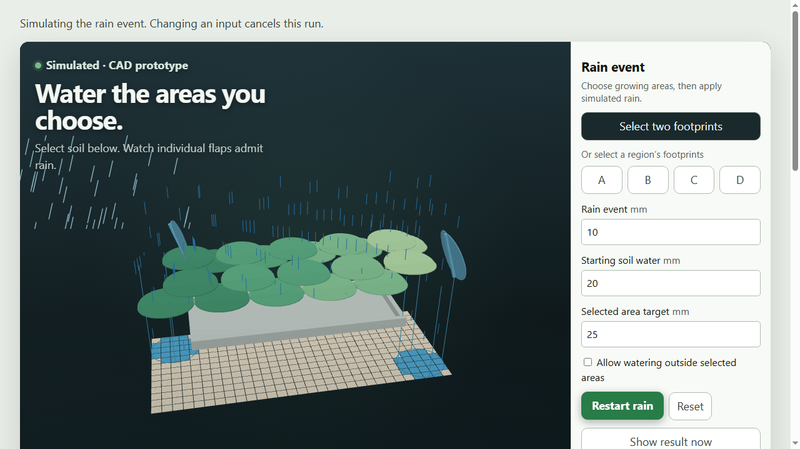
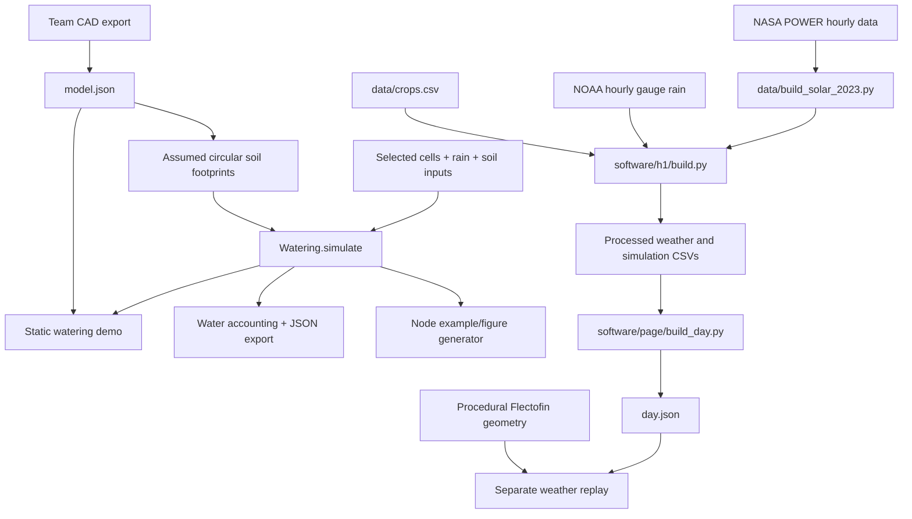

# Flecto Shade

**Select growing areas and simulate how circular roof flaps deliver rain to them.**

[Run locally](#setup) · [Recorded demo](https://github.com/andomo3/flecto-shade/pull/5#issuecomment-5747121392) · [Presentation](pitch/presentation.html) · [Team workflow](CONTRIBUTING.md) · [Issues](https://github.com/andomo3/flecto-shade/issues)

Built at HackMIT 2026 · Plain HTML/CSS/JavaScript + WebGL · Python 3.13 · [MIT](LICENSE)

> **Demo status:** this revision includes farmer-selected watering and a separate Florida weather replay.
> All roof and water results are simulated. A permanent public demo URL and final submission recording are still pending.



*Recorded watering demo at revision `15ebcfd`. Its controller and renderer are preserved; that earlier recording does not cover the secondary console or navigation between the pages. Current integration evidence is tracked in PR #5.*

## Problem

Different crops, growth stages and soil conditions call for different exposure.
A bed that needs water and a bed that is already wet should not necessarily receive the same storm.

UF/IFAS's Apopka guidance documents different shade requirements across foliage crops and seasons.
Its guidance also warns that additional water on saturated growing media can leach fertilizer.
Our [problem research](planning/docs/research/flectofin-greenhouse-roof/problem-framing.md) links the sources and distinguishes the evidence from our design proposal.

## What we built

- **Farmer-selected growing areas:** click, drag or use the keyboard to select soil cells; A-D are selection shortcuts.
- **A rain-event controller:** set rain depth, starting soil water, target and capacity, then watch deterministic combinations of individual circular flaps open and close.
- **Visible limits and accounting:** inspect covered/uncovered cells, target shortfalls, selected/outside delivery, stored water and overflow; allow spill explicitly and export the inputs/results as JSON.
- **An interactive CAD roof:** the team's 22 circular flaps, rain animation and orbit/zoom camera controls.
- **A secondary weather and zone console:** explore 3 June 2023 at `console.html`, with the team's procedural Flectofin renderer, crop rules, configuration controls and optional API persistence.
- **Offline static demos:** local assets and precomputed weather data; CAD watering makes no API calls, and the console supports an explicit offline mode when its optional API is unavailable.

## Tech stack

| Layer | Technology |
| --- | --- |
| Browser app | Plain HTML, CSS, vanilla JavaScript and WebGL |
| Rain-event controller | Deterministic browser JavaScript, also reused by Node tests and the figure generator |
| Weather simulation | Python 3.13, pandas 2.2.3, numpy 2.2.3 |
| Optional console persistence | Python standard-library API and local SQLite; no new dependencies |
| Checks | pytest 9.0.2, Node tests, Ruff correctness checks, JavaScript syntax checks, GitHub Actions |
| Weather | NASA POWER modeled radiation/temperature and NOAA ISD gauge rainfall |
| Serving | Python's standard-library HTTP server, or a static host |

No backend, database, Docker or frontend build is required to run the static demos.
Node is used only for development checks and figure generation.
The secondary console's optional [API](software/api/README.md) stores configuration and simulation runs locally; deployed durable storage is not implemented.

## Architecture



Rain-event results are computed in the browser.
Raw weather downloads stay outside git; processed inputs and runtime assets are versioned so the demos can run offline.

## Setup

With Python installed, the demo takes three commands:

```bash
git clone https://github.com/andomo3/flecto-shade.git
cd flecto-shade
python -m http.server --directory software/page 8000
```

Open `http://localhost:8000`.
No accounts, API keys or raw-data download are needed to view the checked-in demo.
Select growing areas, set the rain and soil inputs, then start the rain event.
Use the weather and zone console link for the secondary demonstration; the old `replay.html` URL redirects there.
The secondary console's procedural roof and weather rules are distinct from the primary demo's CAD geometry and manually configured rain event.
To enable local console persistence, run `python software/api/local_server.py --port 8000` instead of the static server.

For Python 3.13 development dependencies, raw inputs and test commands, see [CONTRIBUTING.md](CONTRIBUTING.md#development-checks) and [data provenance](data/README.md).
CI verifies both documented weather snapshots and runs Python/JavaScript checks, including offline build tests.
It does not publish a deployment.

## Reproducible results and demo media

The default two-footprint example reaches **42/42** selected targets with **21.1 mL** selected delivery and **0.0 mL** outside delivery/overflow.
These are simulated at the approximately **129 × 304 mm CAD scale**, not a farm-scale savings benchmark.
See [results](pitch/results.md) and [full-precision examples](pitch/examples.json) for inputs and other cases.

```bash
node --test software/tests/watering.test.cjs
node software/tools/build_watering_examples.cjs --check
node --check software/page/app.js
node --check software/page/watering-renderer.js
node --check software/page/watering-app.js
```

To regenerate examples, figures and the self-contained presentation, omit `--check`.
Do not manually edit generated outputs.
The [presentation](pitch/presentation.html), [demo script](pitch/demo.md) and [recorded browser acceptance](https://github.com/andomo3/flecto-shade/pull/5#issuecomment-5747121392) support the farmer-selected rain-event flow.
The final public demo and submission recording must match the submitted frontend; see the [release checklist](CHECKLIST.md).

## Evidence and limits

The supplied STEP establishes **22 flap instances in two overlapping layers plus a base**.
Its geometry agrees with the H2 mesh within approximately 0.08 mm.
Independent circles of **25 mm radius**, their offsets and the rectangular soil grid are assumptions.

Cells whose centres lie inside an open footprint receive rain.
Open footprints form a union so overlapping flaps do not double-count water.
Conservative mode excludes apertures that would wet unselected or already-satisfied cells.
A deterministic greedy combination advances to the next receiving-cell target, then replans.
Spill is an explicit opt-in; capacity overflow is tracked separately.
Greedy selection is not proven globally optimal.

The event model checks `event = admitted + excluded`, `admitted = selected + outside`, and `initial soil + admitted = final soil + overflow`.
It does not calculate cross-layer/base obstruction, wind, runoff redistribution, evaporation, crop response, physical folding or actuator performance.

For the separate weather replay, NASA POWER radiation and temperature are **modeled**; NOAA rain is a **gauge observation**.
Its soil-water model reduces modeled crop water use with roof opening and needs refinement before supporting a water-savings claim.
See [dataset provenance and assumptions](data/README.md).

The [FAWN agricultural-data research](planning/docs/research/flectofin-greenhouse-roof/agricultural-data-voloridge.md) proposes measured-weather comparisons.
Its analysis figures remain provisional until reproduced by checked-in project code.
The project does not establish crop-yield improvement, soil restoration, hydraulic performance, actuator reliability or farm-scale water savings.

The Flectofin mechanism is credited to ITKE at the University of Stuttgart, patent EP2320015.
Our contribution is the simulation and control demonstration; we do not claim to have invented the mechanism or established patent novelty.
See [mechanism credits](planning/docs/research/flectofin-greenhouse-roof/fin-patent-and-credit.md).

## What's next

- [ ] Finish frontend polish, publish the approved static demo and rehearse the submission.
- [ ] Ask a grower to test the area-selection workflow.
- [ ] Measure physical flap behavior, rain footprints, layer blockage and drainage.
- [ ] Compare adaptive shade with fixed shade using crop, soil-moisture and temperature measurements.

## Team

| Contributor | Contributions |
| --- | --- |
| Abba Otieno Ndomo ([andomo3](https://github.com/andomo3)) | Product direction, software integration, research and pitch |
| Ameya Tanikella | Weather/data engineering, simulation, CAD rendering and frontend |
| Shannon | Roof layout and design |

## Contributing

Use short-lived `feat/` or `fix/` branches, small conventional commits, owned issues and tested, reviewed PRs.
Keep `main` working; never push or force-push directly to it.
Read the [shared workflow](CONTRIBUTING.md) and [release checklist](CHECKLIST.md).

## AI tools and prior work

Devin, from Cognition, assisted with implementation, integration and checks.
Claude, from Anthropic, assisted with planning, research and documentation.
The roof controller uses deterministic rules; no learned model runs in its control loop.
Source credits and the prior-work disclosure are collected in the [submission material](pitch/submission.md).

Before the event, the team researched and planned a different idea in [hack-mit](https://github.com/andomo3/hack-mit), including a labeled throwaway prototype.
That idea was set aside on Saturday. This shade-house project was chosen and built during the hacking period; no code was copied from that planning repository.

## License

[MIT License](LICENSE) covers this repository's code.
Third-party mechanisms and datasets retain their own rights and credits; this license grants no rights to ITKE's mechanism.
