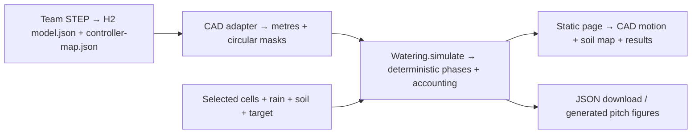

# Shade house — water the areas you choose

**A farmer selects growing areas; a simulated roof combines circular flap openings to water them and explains any shortfall.**

HackMIT 2026 · Static HTML/CSS/JavaScript + WebGL · All water results simulated

**Demo status:** Working farmer-selected watering MVP on [PR #5](https://github.com/andomo3/flecto-stop/pull/5). Use that branch until it is merged. Browser evidence and review live on the PR. A permanent public demo has not been deployed as part of this change.

[Presentation](pitch/presentation.html) · [45-second demo script](pitch/demo.md) · [Reproducible figures](pitch/results.md) · [Model boundary](#what-the-model-does-and-does-not-prove)

[Watch the passing demo and view screenshots](https://github.com/andomo3/flecto-stop/pull/5#issuecomment-5747121392).

## Problem

Imagine a shade-house grower near Apopka, Florida, wanting rain on two areas while their neighbours stay dry. The useful question is spatial: which roof openings reach the requested soil, and which also wet protected areas? This is an illustrative scenario; no customer adoption or crop improvement is claimed.

## What we built

- Select soil cells by click, drag or keyboard; choose a two-footprint preset, region footprints or the full rectangle.
- Apply a rain event with an initial soil-water depth and a target.
- Watch the team's CAD flaps open individually, orbit/zoom the roof and inspect the projected footprints.
- See met targets, protection conflicts, uncovered cells and rain-exhausted shortfalls.
- Inspect selected/outside delivery, storage, overflow, admitted/excluded rain and the opening sequence; download the full result as JSON.
- Keep the earlier Florida weather replay on a separate page. Time of day is not part of the primary interaction.

## Run locally

No dependency installation, Docker, account, API key or frontend build is needed to open the committed demo. Use Python 3 to serve the static directory:

```bash
git clone --branch devin/1789868897-area-watering https://github.com/andomo3/flecto-stop.git
cd flecto-stop
python -m http.server --bind 127.0.0.1 --directory software/page 8000
```

Open `http://localhost:8000`, click **Select two footprints**, then **Simulate rain**. Use HTTP rather than opening the page as a file, because it loads local JSON. The complete folder runs without external network access after the local server starts. WebGL2 is needed for the CAD view; the soil controller remains available if CAD rendering fails.

Defaults: rain 10 mm, soil 20 mm, target 25 mm, outside watering off. **Reset** restores those inputs and clears selection. Each run starts from the input soil value. Reduced-motion preferences skip animation intentionally.

The separate weather replay is `replay.html`; its crop/weather rules and outputs are distinct from the manually configured rain event.

## Architecture and tech stack



| Part | Implementation |
|---|---|
| Primary runtime | Plain browser JavaScript, HTML/CSS, WebGL2; no backend |
| Controller | `software/page/watering-model.js`: `fromCAD`, `footprints`, `simulate` |
| Page integration | `watering-app.js`, shared CAD renderer `app.js`, `index.html` |
| Figure generation | Node script reuses the same controller; no new dependencies |
| Earlier replay | Committed `day.json` generated by the Python weather/crop pipeline |
| Local hosting | Python standard-library HTTP server; any static host can serve the folder |

## Reproducible results and checks

The default two-footprint example reaches **42/42** selected targets with **21.1 mL** selected delivery and **0.0 mL** outside delivery/overflow. These are simulated at the approximately **129 × 304 mm** CAD scale. See [results](pitch/results.md) and [full-precision examples](pitch/examples.json) for inputs and other cases; rounded figures are not a savings benchmark.

The controller and generator were checked with Node 20.19:

```bash
node --test software/tests/watering.test.cjs
node software/tools/build_watering_examples.cjs --check
node --check software/page/app.js
node --check software/page/watering-app.js
```

To regenerate figures and the self-contained slide deck, omit `--check`. Do not manually edit the generated examples, results or presentation.

For the separate Python simulation/tests, use the repository's Python 3.13 environment, install `software/requirements.txt`, and run `python -B -m pytest software/tests -q -p no:cacheprovider`. Some data tests require the ignored raw weather inputs documented in [data/README.md](data/README.md). They are not required to run the committed primary demo.

## Screenshots and recording

The latest browser recording and screenshots are linked with the validation evidence on [PR #5](https://github.com/andomo3/flecto-stop/pull/5). Download them before judging. The [presentation](pitch/presentation.html) opens directly as a self-contained local HTML file and supports browser Print → Save as PDF.

## What the model does and does not prove

The supplied STEP establishes **22 flap instances in two overlapping layers plus a base**. Its geometry agrees with the existing H2 mesh within approximately 0.08 mm. The controller uses assumed independent circles of **25 mm radius**, offset from each component origin; choosing the assembly's XY bounding rectangle as soil is also an assumption.

Cells whose centres lie inside a circle receive rain when that flap is open. Open footprints form a union: overlapping flaps never double the rain. Strict mode excludes apertures that would wet an unselected or already-satisfied cell. A deterministic greedy combination advances to the next receiving-cell target, then replans. Spill mode is an explicit opt-in; capacity overflow is tracked separately.

The simulation checks `event = admitted + excluded`, `admitted = selected + outside`, and `initial soil + admitted = final soil + overflow`. It does not calculate cross-layer/base obstruction, wind, runoff redistribution, evaporation, crop response, physical folding or actuator performance. Greedy selection is not proven globally optimal.

No working roof, crop-yield improvement, physical water savings, actuator speed or new mechanism patent is claimed. Inspiration: **ITKE Flectofin, EP2320015**; the license on our code conveys no rights to that mechanism.

## Next steps

- [ ] Measure actual rain footprints and blockage through the layered CAD geometry.
- [ ] Ask one grower to test the area-selection workflow.
- [ ] Compare the controller with a small actuated, instrumented physical section.

## Team

| Contributor | Project role |
|---|---|
| [Abba Otieno Ndomo](https://github.com/andomo3) | Software direction and integration |
| Ameya Tanikella | Weather/crop simulation and CAD handoff |
| Shannon | Roof layout, per the project team record |

Devin (Cognition) assisted implementation, testing and documentation; Claude (Anthropic) assisted earlier planning and research. No AI model runs in the roof controller. Earlier research/planning is at [andomo3/hack-mit](https://github.com/andomo3/hack-mit); source attribution and submission text are in [pitch/submission.md](pitch/submission.md).

## License

[MIT](LICENSE) covers the repository's code. Mechanism and dataset rights remain with their respective owners.
