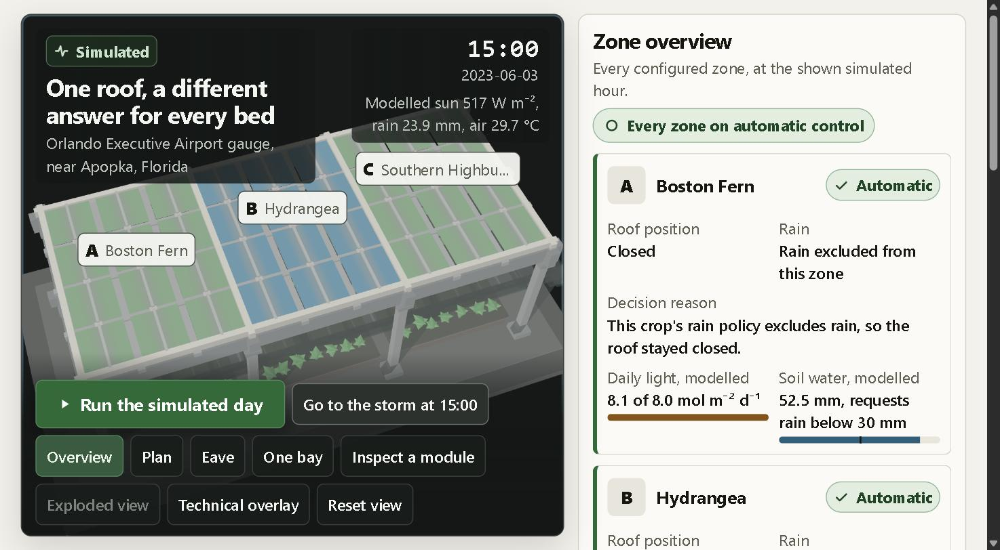
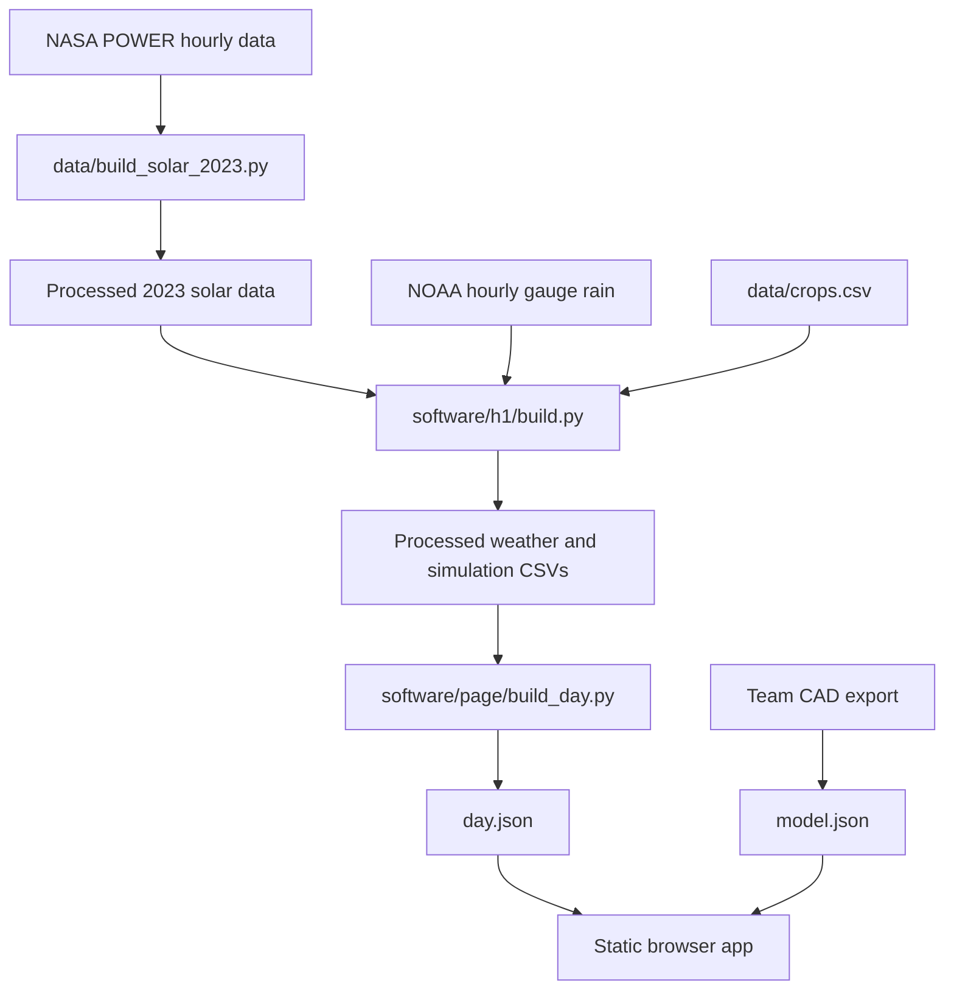

# Flecto Shade

**An adaptive shade-house simulation for giving growing areas different amounts of light and rain.**

**[Open the live demo](https://page-five-kappa.vercel.app)** · [Run locally](#setup) · [Team workflow](CONTRIBUTING.md) · [Issues](https://github.com/andomo3/flecto-shade/issues)

Built at HackMIT 2026 · Plain HTML/CSS/JavaScript · Python 3.13 · [MIT](LICENSE)

> **Current status:** the live demo runs the whole simulated day of 3 June 2023 near Apopka, Florida, in about forty seconds, for three growing zones.
> It is deployed as a static page, so the configuration workspace shows its offline state and holds changes in the session only.
> Everything on it is simulated from public weather inputs, and no value on it is a validated engineering result.



*One storm, three answers: the hydrangea opens because its soil is dry, the blueberry stays shut because its soil is already wet enough, and the fern stays shut because its crop excludes rain. Simulated.*

> This screenshot predates the landing page and console redesign merged on the morning of 2026-09-20. The decisions it shows are current; the styling is not. Open the live demo for what the page looks like now.

## Problem

Different crops, growth stages and soil conditions call for different exposure.
A bed that needs water and a bed that is already wet should not necessarily receive the same storm.

UF/IFAS's Apopka guidance documents different shade requirements across foliage crops and seasons.
Its guidance also warns that additional water on saturated growing media can leach fertilizer.
Our [problem research](planning/docs/research/flectofin-greenhouse-roof/problem-framing.md) links the sources and distinguishes the evidence from our design proposal.

## What we built

- **An interactive CAD roof viewer:** the team's circular flaps, animated roof states and camera controls.
- **A weather replay:** 3 June 2023 in the Apopka area, with crop-specific decisions and explanations.
- **A reproducible simulation:** deterministic light/rain rules and soil-water buckets driven by public 2023 weather inputs.
- **An offline static page:** local assets and precomputed data, without runtime API calls.

A farmer-driven watering flow was prototyped in [PR #5](https://github.com/andomo3/flecto-shade/pull/5) and is **not merged**.
It replaced the console and the roof viewer rather than adding to them, and it introduced a second rain model beside the shared rules, so it was not taken.
The farmer-driven work is being rebuilt as a component that adds to the current page instead.

## Tech stack

| Layer | Technology |
| --- | --- |
| Browser app | Plain HTML, CSS, vanilla JavaScript and WebGL |
| Data and simulation | Python 3.13, pandas 2.2.3, numpy 2.2.3 |
| Checks | pytest 9.0.2, Ruff correctness checks, JavaScript syntax checks, GitHub Actions |
| Weather | NASA POWER modeled radiation/temperature and NOAA ISD gauge rainfall |
| Serving | Python's standard-library HTTP server, or a static host |

No backend, database, Docker or frontend build is required to run the checked-in page.
Node is used only for development checks and browser-controller tests.

## Architecture



This diagram describes the merged weather-replay pipeline.
Raw downloads stay outside git; processed inputs and runtime JSON are versioned so the page can run offline.
The farmer-area controller in PR #5 computes rain-event results in the browser.

## Setup

With Python installed, the existing demo takes three commands:

```bash
git clone https://github.com/andomo3/flecto-shade.git
cd flecto-shade
python -m http.server --directory software/page 8000
```

Open `http://localhost:8000`.
No accounts, API keys or raw-data download are needed to view the checked-in page.

For Python 3.13 development dependencies, raw inputs and test commands, see [CONTRIBUTING.md](CONTRIBUTING.md#development-checks) and [data provenance](data/README.md).
CI downloads and verifies the two documented weather snapshots, checks Python/JavaScript and runs the tests, including offline build checks.
It does not publish a deployment.

## Demo media

The live demo is at <https://page-five-kappa.vercel.app>, deployed from `main` on 2026-09-20.
The hero image above is a screenshot of that page, taken at 15:00 on the simulated day.

The [recorded watering preview](https://github.com/andomo3/flecto-shade/pull/5#issuecomment-5747121392) belongs to the unmerged PR #5 and does not show what the live page does.
The submission recording must match the deployed page, and its handoff is tracked in the [release checklist](CHECKLIST.md).

## Evidence and limits

NASA POWER radiation and temperature are **modeled**; NOAA rain is a **gauge observation**.
Roof states, crop light exposure and soil-water accounting are **simulated**.
See [dataset provenance and model assumptions](data/README.md) before using any figures.

The current soil-water model reduces modeled crop water use with roof opening.
It needs refinement before it can support a water-savings claim.
The project does not establish yield improvement, soil restoration, hydraulic performance, actuator reliability or farm-scale savings.

The Flectofin mechanism is credited to ITKE at the University of Stuttgart, patent EP2320015.
Our contribution is the simulation and control demonstration; we do not claim to have invented the mechanism or established patent novelty.
See [mechanism credits](planning/docs/research/flectofin-greenhouse-roof/fin-patent-and-credit.md).

The [FAWN agricultural-data research](planning/docs/research/flectofin-greenhouse-roof/agricultural-data-voloridge.md) proposes measured-weather comparisons.
Its analysis figures remain provisional until reproduced by checked-in project code.

## What's next

- [ ] Integrate farmer-selected watering with the team's final frontend and publish the demo.
- [ ] Compare adaptive shade with fixed shade using crop, soil-moisture and temperature measurements.
- [ ] Validate physical flap behavior, drainage and rain delivery before making field-performance claims.

## Team

| Contributor | Contributions |
| --- | --- |
| Abba Otieno Ndomo ([andomo3](https://github.com/andomo3)) | Product direction, software integration, research and pitch |
| Ameya Tanikella | Weather/data engineering, simulation, CAD rendering and frontend |
| Shannon | Roof layout and design |

## Contributing

Use short-lived `feat/` or `fix/` branches, small conventional commits, owned issues and tested, reviewed PRs.
Keep `main` working; never push or force-push directly to it.
Read the [shared workflow](CONTRIBUTING.md) and [release checklist](CHECKLIST.md).

## AI tools and prior work

Devin, from Cognition, assisted with implementation, integration and checks.
Claude, from Anthropic, assisted with planning, research and documentation.
The roof controller uses deterministic rules; no learned model runs in its control loop.
Library, dataset and crop-source credits are collected in the [submission material](planning/pitch/submission.md).

## License

[MIT License](LICENSE) covers this repository's code.
Third-party mechanisms and datasets retain their own rights and credits; this license grants no rights to ITKE's mechanism.
