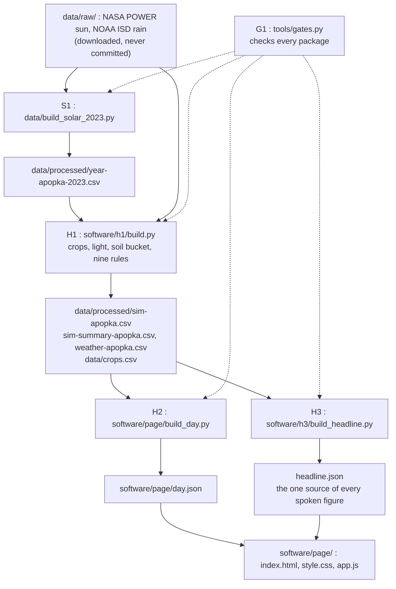

# Smart louvre roof

**One shade house roof, three beds, three different answers to the same sky, simulated on a real year of Florida weather.**

[](https://hackmit.org/)
[](LICENSE)
[](https://www.python.org/)
[](#tech-stack)
[](#what-is-ours-and-what-is-not)

---

> **Status, Saturday evening, 2026-09-19.**
> The plan and every specification are written, and the code is being written now, during the hacking period.
> The live link and the screenshots go here as soon as the page plays its first day.
> See [the board](CHECKLIST.md) for what is merged.

## Problem

**What a plant needs depends on the state of its own bed, and a shade house gives every bed one number.**

The University of Florida's centre at Apopka, in the heart of Florida's nursery industry, publishes a table for foliage growers: 50 crops, with shade from "30 - 60%" to "80 - 90%".
One crop does not sit still either: for croton, "30% shade is not quite enough in summer, but 47% is too much in winter."
And the same plant changes: the centre's guides have a fig grown bright for its trunk and then held under heavy shade for months before sale, which today means a second structure, and moving the plant.

The way such a roof works today is a fine brain and a blunt hand.
The climate computer is already fine grained: it holds a daily light target, and it starts irrigation valve by valve.
The roof is not: it is one cloth, or one curtain, and "One gear motor will handle up to 50,000 sq ft of roof", in the words of a UMass fact sheet.
So every plant under it gets one decision.

Rain is the same problem.
Under shade cloth a storm falls on every bed alike, and the FAO's paper on effective rainfall says why that is wrong: a shower after irrigation "becomes surplus water and is lost", where on dry soil it is "a saving in irrigation water".
The Apopka report adds that water on "already saturated media will leach fertilizer and possibly contribute to ground water pollution".

The sources, and what we tested and dropped, are in [the problem framing](planning/docs/research/flectofin-greenhouse-roof/problem-framing.md), [the market research](planning/docs/research/flectofin-greenhouse-roof/market-and-differentiation.md), and [the simulation's specification](planning/plans/packages/H1-zones-light-rain-soil.md).

## Solution

**A roof made of many small hingeless fins, grouped into zones, that decides bed by bed.**

Each zone gets its own light, uses the rain when its soil is dry, and is kept out of the rain when its soil is wet.
The irrigation system stays: eight months of the Florida year are dry, and the roof decides only whether today's rain is used or thrown away.
We simulate that roof over three crop zones near Apopka, Florida, hour by hour through 2023, and one page plays one real day of it in about forty seconds.

Why fins, and why this fin: deciding bed by bed takes a roof of many small parts, and with hinges every one of them is a bearing to grease, which the growers' own guides already list as a chore.
The Flectofin is a thin blade that bends open with no hinge, and the same part shades, opens for air, and lets the rain through.
That is our argument and not a finding: no saving is quantified, by our sources or by us.

### How it works

1. **The sun and the rain.** A year of hourly sun from NASA POWER and hourly rain from the Orlando Executive Airport gauge, the same place and the same year, so that rainy hours are darker hours.
2. **Three zones, three light classes.** The three crops are the ones whose published daily light figures we could source: Boston fern and hydrangea each have a daily light target, blueberry has a shade share, and each crop opts in or out of rain.
3. **Nine written rules.** Every hour, every zone's fins open or shut by nine deterministic rules, in the priority night, then rain, then light, with a soil water bucket per zone.
4. **One day, played back.** The page shows the roof from above and plays 3 June 2023: the fern's zone shuts by eleven, the hydrangea's by noon, the blueberries stay open, and then an afternoon storm gets three different answers, each with its reason in words.
5. **The result card.** Each crop's light against its target, the rain's share of each zone's water, and the year by month.

## Live demo

Not up yet.
A static copy of the page goes on Vercel once it plays the demo day, and the address goes here.
The demo at the table runs from the laptop with the network off.

## What is ours, and what is not

Said up front, because a judge who knows horticulture will know most of this exists.

| Whose | What |
| --- | --- |
| **Not ours** | The fin. It is the Flectofin, by ITKE at the University of Stuttgart, patented as EP2320015. See [whose fin it is](planning/docs/research/flectofin-greenhouse-roof/fin-patent-and-credit.md) |
| **Not ours** | Watering by the sun's energy and holding a daily light target, which greenhouse computers from Ridder, Hoogendoorn, Argus, and Priva already do |
| **Not ours** | A moving roof over crops, which Cravo and Sun'Agri already sell |
| **Ours** | The size of the decision: a bed, not a building. We found no prior proposal to put a Flectofin over crops, which is an absence in our searches and not proof |
| **Simulated** | Everything. Nothing physical was built, no fin was printed, and every figure on every screen says simulated or modelled. The one real record is the rain gauge |
| **Not claimed** | Yield, cost, water or energy saved, safety from disease, wind, hail, or a built roof. We tested three wider claims against sources and dropped them: that irrigation is wasted, that motor energy is saved, and that lamp costs fall |

Growers keep rain off glasshouse crops on purpose, because wet leaves bring disease.
That is why this is a shade house, why each crop opts in to rain, only in daylight and only with time to dry, and why the fern opts out.
Shading blueberries is not Florida practice, and that figure comes from Washington State.

## Features

- Three crop zones under one roof, each with its own light rule taken from a published source
- A roof of fins per zone that opens and shuts by nine written rules, with each zone's reason shown in words
- Real hourly rain from one gauge and the sun for the same place and year
- A soil water bucket per zone, with the grower's own irrigation as the backstop
- One page that plays one day, from a single Play button, and ends on a result card
- The year's summary, by zone and by month
- No AI and no learned model anywhere in the roof's control loop, and fins that never track the sun's position
- Runs with no network: no CDN, no web fonts, no framework, no build step

## Tech stack

| Layer | Technology | Why |
| --- | --- | --- |
| Simulation | Python 3.13, `pandas==2.2.3`, `numpy==2.2.3` | A year of hourly data is a table, and the rules are a loop over it |
| Tests and gates | `pytest==9.0.2`, and a gate runner in `tools/` | Every expected value was computed from the real data before any code existed, so a test cannot pass by agreeing with its own mistake |
| Page | Plain HTML, CSS, and vanilla JavaScript, with inline SVG | Nothing to build, nothing to fetch, and it cannot break on venue Wi-Fi |
| Serving | `python -m http.server` at the table, a static copy on Vercel for the link | The folder is served as it is |
| Data | NASA POWER hourly, NOAA ISD global hourly | Public, citable, and for the same place and year |

Next.js and Supabase were considered and set aside, because nothing here is stored and nobody logs in.

## Architecture



Packages meet only through files with a schema, and the page adds no physics: every number it shows was computed by the simulation.

## Setup

Needs Python 3.13.
These are the commands the specifications fix, and each one works once its package is merged, which [the board](CHECKLIST.md) shows.

```bash
git clone https://github.com/andomo3/flecto-stop.git
cd flecto-stop
python -m venv .venv
.venv\Scripts\activate            # on macOS or Linux: source .venv/bin/activate
pip install -r software/requirements.txt
```

Build the year, the simulation, the demo day, and the result card, then serve the page:

```bash
python data/build_solar_2023.py
python software/h1/build.py --city apopka
python software/page/build_day.py --date 2023-06-03
python software/h3/build_headline.py
python -m http.server --directory software/page 8000
```

Then open `http://localhost:8000` and press Play.

The two raw data files are public and are not committed.
Where to download them, and the sha256 of each, is in [the board](CHECKLIST.md) under "Before any package".
There are no environment variables, no keys, and no accounts.

Run the tests and the gates:

```bash
pytest
python tools/gates.py
```

## Project structure

```text
flecto-stop/
├── AGENTS.md          the rules for everyone, human or agent, who works here
├── CHECKLIST.md       the live board: owners, order, interfaces, the clock
├── planning/          the plan, the specifications, the pitch, the research (Markdown only)
├── tools/             the gate runner and its tests
├── data/              the build scripts, crops.csv, and processed/ (raw/ is never committed)
├── software/          the simulation (h1/), the page (page/), the result card (h3/), tests/
├── gates-log/         one gate report per package
└── pitch/             the final scripts and figures, generated from headline.json
```

## What's next

If we had more time, we would:

1. Put this in front of one grower near Apopka and ask where it is wrong, because no grower has seen it yet.
2. Model what we left out on purpose: wind and hail on thin fins, and the cost of many actuators.
3. Build one zone of real fins over one real bed, and replace the modelled sun with a light sensor.

## Team

| Name | Role |
| --- | --- |
| Abba Otieno Ndomo ([andomo3](https://github.com/andomo3)) | Software engineering, integration, and the plan |
| Ameya Tanikella | Data engineering: the sun, the rain, and the simulation |
| Shannon | The roof layout |

## How we used AI tools

The HackMIT rules ask for every AI tool to be cited.

- **Devin**, from Cognition, wrote the code, one work package at a time, from specifications a person planned.
- **Claude**, from Anthropic, was used for planning, research, and these documents.
- No AI and no learned model runs inside the project: the roof follows nine written, deterministic rules.

The open source libraries, the datasets, and the source of every crop figure are cited in [the submission text](planning/pitch/submission.md).

## Prior work, stated plainly

Before the event the team did research and planning in public, at <https://github.com/andomo3/hack-mit>, for a different idea, which was set aside on Saturday.
This project was chosen, planned, and built during the hacking period.
That repo holds research, specifications, a pitch, and one labelled throwaway prototype.
No code was copied from it, and every line of code in this repo is written during the hacking period.

## License

The code in this repo is licensed under the MIT License, see [LICENSE](LICENSE).
The license covers our code only.
The Flectofin is ITKE's, and nothing here grants any right to it.

---

Built at HackMIT 2026.
