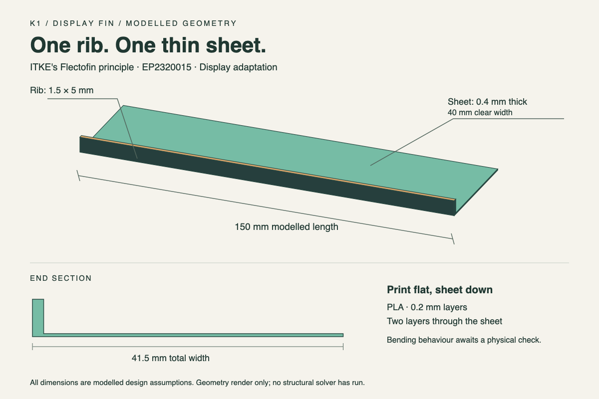

The fin principle is ITKE's Flectofin, patented as EP2320015; this is a modelled display adaptation.

# K1: one rib and one thin sheet

A single L-section fin for the table beside the simulated shade house demo.
The CAD files are ready for slicing; print submission, fabrication, and the person's handling check remain pending.
No structural solver has run, and the geometry does not establish a flare angle, restoring force, or durability.



## Open or print

- Edit [display-fin.scad](display-fin.scad) in [OpenSCAD](https://openscad.org/documentation), render with F6, and export STL after changes.
- Send [display-fin.stl](display-fin.stl) to the printer's slicer, importing its coordinates as millimetres.
- View the scalable [dimensioned geometry render](display-fin.svg).

The STL has a modelled bounding box of 150 × 41.5 × 5 mm and a modelled solid volume of 3,525 mm³.
It contains one continuous solid, with a rib along the full length and no hinges, tabs, holes, or assembly joints.
The coarse-looking count of 20 triangles is sufficient because every surface in this design is planar.
The colours in the render distinguish surfaces, not separate materials.

## Proposed print settings

Use PLA, following the current plan's display-fin material.
Place the broad sheet flat on the bed, with its lower surface at Z = 0 and the rib pointing up.
Use a 0.4 mm nozzle and 0.2 mm layers, including the starting layer, so the sheet occupies two layers.
Keep the part at 100 percent scale and use solid fill with supports off.
Use the print desk's validated PLA temperatures, speed, adhesion, and cooling profile for its printer and filament.
Inspect the sliced layers to confirm that the entire sheet exists and joins the rib continuously.
If the slicer omits the sheet, resolve its thin-feature settings before submitting the print.
No printer profile or G-code is supplied because the printer and filament are not known.

After printing, let the part cool before removing it and support the sheet while lifting it.
Hold the rib ends and try a small, gentle bend; stop if it cracks, whitens, or keeps a permanent bend.
A person must establish whether its motion is suitable before inviting the judge to bend it.
The flat, untapered outline and sharp junctions are a minimal display design, not an optimized compliant mechanism.

## Where to simulate

The event demo's crop, light, rain, and soil model belongs in the local Python H1 simulation and the H2 browser page.
The CAD geometry does not drive those results.
Do not add mechanical analysis to the offline demo's runtime.

For an optional engineering study of the fin itself, use [SimScale nonlinear structural analysis](https://www.simscale.com/simulations/nonlinear-structural-analysis/).
It supports geometric nonlinearity, including large deformation and buckling.
This is an online workflow, separate from the offline event demo.

1. Import the STL with millimetre units, automatic sewing, and facet splitting enabled, then verify the 150 mm length and that the import produced one solid.
2. If the solid import or boundary selection is unsuitable, recreate the same two overlapping rectangular prisms in a solid CAD tool, fuse them, and export STEP.
3. Choose a nonlinear static analysis with geometric nonlinearity enabled.
4. Partition the end faces so constraints act on the rib ends only, leaving the sheet's other edges free.
5. Choose supports that represent the intended handling or fixture, then ramp prescribed end shortening in small increments.
6. Include a small documented geometric imperfection or lateral seed to select the buckling direction, and check sensitivity to that choice.
7. Use material properties supported for the actual printed PLA and orientation; a generic elastic material cannot establish fracture or fatigue behaviour.
8. Refine the mesh through the thin sheet and at the rib junction, and compare finer meshes before interpreting displacement, strain, or reaction force.

This is a proposed setup, not an executed or validated simulation.
Supports, imperfection, material law, and mesh resolution affect the answer.
Account access to nonlinear analysis has not been checked.
See [SimScale CAD import](https://www.simscale.com/docs/cad-preparation/) and [static analysis setup](https://www.simscale.com/docs/analysis-types/static/).

## Modelled assumptions

All entries below are proposed design or fabrication choices, not experimentally established properties.
The named values live in `build_fin.py`; the geometry values also appear as editable parameters in the OpenSCAD file.

| Named constant | Value | Basis |
|---|---|---|
| `RIB_LENGTH_MM` | 150 mm | Starting span in the planning fin-dimension note |
| `RIB_THICKNESS_MM` | 1.5 mm | Thinner rib option in that note |
| `RIB_HEIGHT_MM` | 5 mm | Starting rib height in that note |
| `SHEET_CLEAR_WIDTH_MM` | 40 mm | Display design choice for this K1 artifact |
| `SHEET_THICKNESS_MM` | 0.4 mm | Sheet option in the planning note |
| `LAYER_HEIGHT_MM` | 0.2 mm | Layer height in the planning note |
| `NOZZLE_DIAMETER_MM` | 0.4 mm | Proposed slicer choice; confirm at the print desk |

## Rebuild and check offline

Use the team's Python 3.13 virtual environment; no additional Python packages are required.
From the repository root:

```sh
python hardware/fin/build_fin.py
python hardware/fin/build_fin.py --check
```

The builder writes the STL, OpenSCAD file, and SVG from one set of dimensions.
The checker independently reads the exported STL and verifies dimensions, positive volume, nondegenerate triangles, connectivity, closed edges, opposite edge directions, and solid topology.
The PNG is a presentation copy rendered from the SVG with macOS Quick Look and cropped with `sips`; it is not regenerated by the Python command.
If dimensions change, regenerate the PNG or use the updated SVG in this README.
Edit `build_fin.py` to keep every generated file synchronized; direct edits in OpenSCAD are suitable for separate variants and will be flagged by the consistency check.

OpenSCAD is not installed on this laptop, so the SCAD source was read but has not been rendered by OpenSCAD here.
The supplied STL was generated directly, passed its checks, and its matching SVG render was visually inspected.
The mesh check does not replace the slicer preview or the physical handling check.

## Provenance and scope

- Fin principle: [ITKE Flectofin brochure](https://www.itke.uni-stuttgart.de/img/uploads/2017/12/flectofin_brochure.pdf), and Lienhard et al., [Flectofin: a hingeless flapping mechanism inspired by nature](https://doi.org/10.1088/1748-3182/6/4/045001).
- Current scope: [Plan D](../../planning/plans/plan-d-louvre-roof.md) and K1 in [CHECKLIST.md](../../CHECKLIST.md).
- Dimension starting points: the rib and sheet dimensions in the [planning fin note](../../planning/docs/research/adaptive-bus-stop-canopy/flectofin-leaf-design-loop.md), which `planning/README.md` explicitly retains for K1.
- The rig, servo, fatigue loop, and design-search work in that older note were not built here.
- Authoring and verification: [Python](https://www.python.org/), using its standard library only; editable CAD syntax: [OpenSCAD](https://openscad.org/documentation).
- Render utilities: macOS Quick Look and `sips`.
- AI assistance: OpenAI Codex generated the geometry code and documentation during the event, then ran and inspected the outputs.
- No external CAD mesh, prototype code, crop data, or weather dataset was used to generate this object.
- Attribution is not a patent licence; this package does not grant rights in ITKE's mechanism.

## Person's remaining checklist

- [ ] Open the STL in the actual printer's slicer and confirm dimensions and both sheet layers.
- [ ] Record the printer, filament, final settings, and submission confirmation here.
- [ ] Submit the print before the desk closes.
- [ ] Inspect the fabricated part and try the demo handling once.
- [ ] Report the handling result to the integrator before calling K1 complete.
